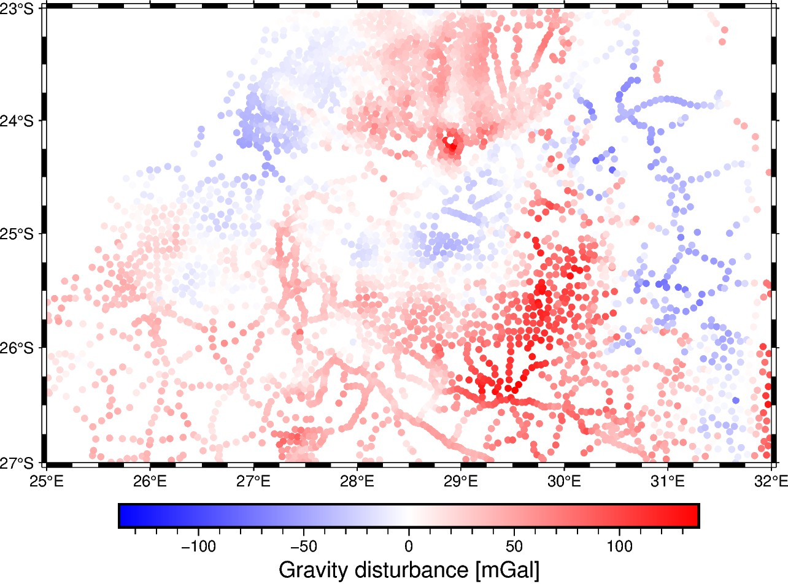

# Bushveld, Southern Africa - Observed and preprocessed gravity

This dataset contains ground gravity observations over the area that comprises
the Bushveld Igenous Complex in Southern Africa, including preprocessed gravity
fields such as the *gravity disturbance* and the *bouguer gravity disturbance*
(topography-free gravity disturbance). In addition, the dataset contains the
heights of the observation points referenced on the WGS84 reference ellipsoid
and over the mean sea-level (what can be considered to be the geoid). This
dataset was built upon a portion of the Southern Africa gravity compilation
available through [NOAA NCEI](https://www.ngdc.noaa.gov/mgg/gravity/).

| | Summary |
|--:|:--|
| File | `bushveld.csv.xz` |
| Size | 0.14 Mb |
| Version | [v1](https://github.com/fatiando-data/v1/releases/latest) |
| DOI | https://doi.org/CHANGEME |
| License | [CC-BY](https://creativecommons.org/licenses/by/4.0/) |
| MD5 | `md5:368284cc210c6bbe256e9e49e892f262` |
| SHA256 | `sha256:3fc1daf74a2fc3bcc3cf7f72a632518f8c6b6e306ce12fddf4055d7cb44945c8` |
| Source | [NOAA NCEI](https://www.ngdc.noaa.gov/mgg/gravity/) (gravity) and [ETOPO1](https://doi.org/10.7289/V5C8276M) (topography) |
| Original license | [public domain](https://ngdc.noaa.gov/ngdcinfo/privacy.html) (gravity) and [public domain](https://ngdc.noaa.gov/mgg/global/dem_faq.html#sec-2.4) (topography) |
| Processing code | [`prepare.ipynb`](https://nbviewer.org/github/fatiando-data/bushveld-gravity/blob/main/prepare.ipynb) |

## Changes made

> These are the changes made to the original dataset.

* The original data were cropped to a region bounded by 25 and 32 degrees on
  longitude and -27 and -23 degrees on latitude.
* Geometric observation heights were obtained by adding geoid heights to the
  original observation heights referenced on the mean sea-level. The geoid
  heights on each observation point were obtained by interpolation of the geoid
  available in doi:
  [10.5281/zenodo.5882205](https://doi.org/10.5281/zenodo.5882205).
* Gravity disturbances were computed by removing the normal gravity of the
  WGS84 computed through [Boule](https://www.fatiando.org/boule).
* Bouguer gravity disturbances were computed by forward modelling the
  topography using [Harmonica](https://www.fatiando.org/harmonica) starting
  from the topography grid provided in doi:
  [10.5281/zenodo.6481379](https://doi.org/10.5281/zenodo.6481379).

## About this repository

This is a place to format and prepare the original dataset for use in our
tutorials and documentation.

We include the source code that prepares the datasets for redistribution by
filtering, standardizing, converting coordinates, compressing, etc.
The goal is to make loading the data as easy as possible (e.g., a single call
to `pandas.read_csv` or `xarray.load_dataset`).
Whenever possible, the code also downloads the original data (otherwise the
original data are included in this repository).

> 💡 **Tip:** The easiest way to download this dataset is using
> [Pooch](https://www.fatiando.org/pooch), particularly to download straight
> from the DOI of a release.

## Contributing

See our [Contributing Guidelines][contrib] for information on proposing new
datasets and making changes to this repository.

## License

All Python source code is made available under the BSD 3-clause license. You
can freely use and modify the code, without warranty, so long as you provide
attribution to the authors.

Unless otherwise specified, all data files and figures created by the code are
available under the Creative Commons Attribution 4.0 License (CC-BY).

See [`LICENSE.txt`](LICENSE.txt) for the full text of each license.

The license for the original data is specified in this `README.md` file.

[contrib]: https://github.com/fatiando-data/.github/blob/main/CONTRIBUTING.md
